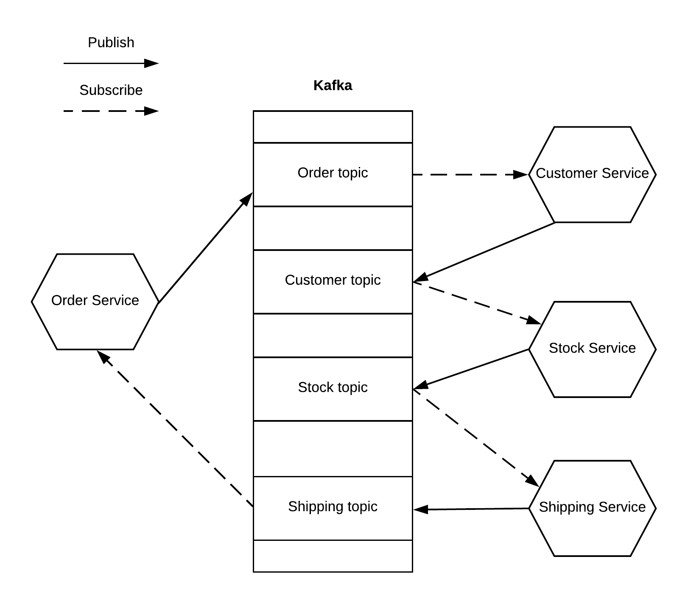

# Saga Pattern

## Introduction
In a microservice architecture services usually contain their own databases, which are tailored for the storage requirements of the service. This also known as the Database per servcie pattern. Some business transactions span accross multiple services and require data consitency across the services. For example placing an order in an E-commerce application might require a transaction across payment and shipping services. In a monolithic architecture transactions are simple with the ACID guarantees of a relational database. To implement transactions in a microservice architecture, distributed transactions are required. The Saga is a pattern for distributed transactions.

The Saga pattern is a sequence of local transactions where each transaction updates data within a single service and publishes a message or event to trigger the next transaction in the "saga". The local transactions are coordinated in a way, that if one transactions fails, all previous transactions are compensated. There are two common ways for coordination sagas: orchestration and choreography.

Altough the Saga pattern has become more popular with the advent of microservices, it isn't a particularly new concept. It was first [published](https://www.cs.cornell.edu/andru/cs711/2002fa/reading/sagas.pdf) back in 1987.

## Experimentation setup

### Overview of the Architecture

#### Order Service

#### Customer Service

#### Stock Service

#### Shipping Service

### Kafka

## Experiments and Observations

## Conclusions and lessons learned